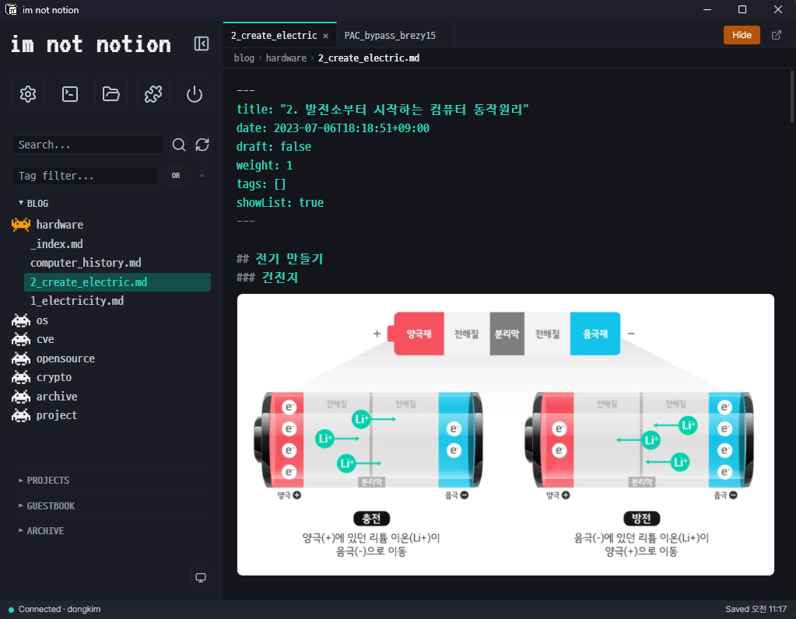

## IM NOT NOTION
This is a tauri(rust + svelte) project that allows you to manage content by connecting to a static content site server such as hugo via ssh.
After setting up the server within the app, you can freely edit the post.

## DOCS
### Guide — 사용자 가이드

| Document | Description |
|----------|-------------|
| [GETTING_STARTED.md](./docs/guide/GETTING_STARTED.md) | 빌드, 설치, 실행 방법 |
| [SERVER_SETUP.md](./docs/guide/SERVER_SETUP.md) | 서버 초기 세팅 (SSH, 유저, Docker, 패키지) |
| [PLUGINS.md](./docs/guide/PLUGINS.md) | 플러그인 사용 가이드 (autopush, autosquash, backup, image-link) |

### Internal — 내부 동작 가이드

| Document | Description |
|----------|-------------|
| [ARCHITECTURE.md](./docs/internal/ARCHITECTURE.md) | Tech stack, 프로젝트 구조, 아키텍처, 데이터 흐름 |
| [IPC_API.md](./docs/internal/IPC_API.md) | Frontend ↔ Backend IPC 커맨드 레퍼런스 (45개) |
| [IMAGE_SYNC.md](./docs/internal/IMAGE_SYNC.md) | 이미지 관리: 저장/이동/붙여넣기 sync, 고아 정책, 플러그인 |
| [PLUGIN.md](./docs/internal/PLUGIN.md) | 플러그인 시스템: manifest, trigger, JSON 프로토콜, 타입 |
| [MOVE_CONTENT_OPTIMIZATION.md](./docs/internal/MOVE_CONTENT_OPTIMIZATION.md) | move_content SFTP 호출 최적화 계획 |

### Development

| Document | Description |
|----------|-------------|
| [TODO.md](./docs/TODO.md) | 기능 추적, 리팩토링 노트 |
